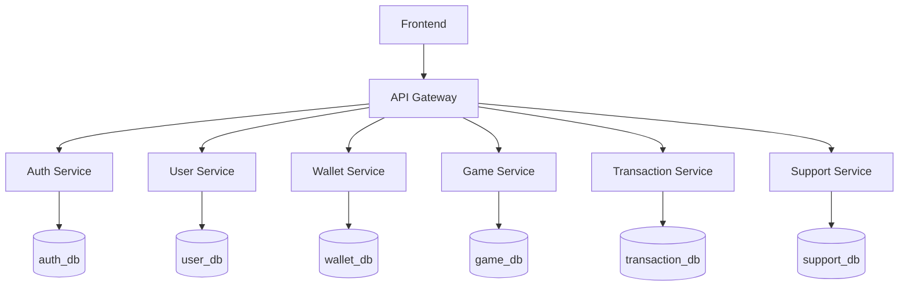
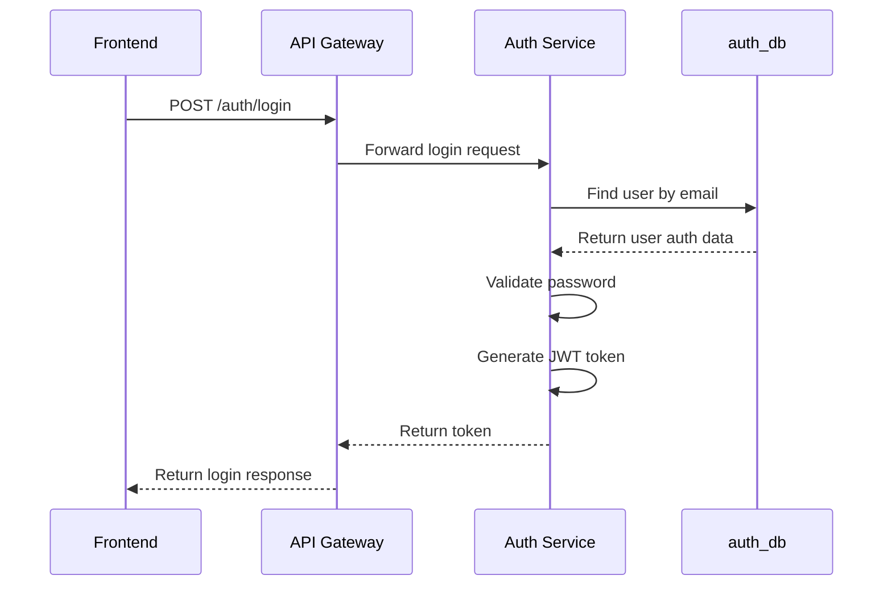

# Architecture Overview

The project will use a microservice-based backend architecture.

The frontend will communicate with the backend only through the API Gateway.  
The API Gateway will forward requests to internal services.

## Planned Services

The system will contain the following services:

- API Gateway
- Auth Service
- User Service
- Wallet Service
- Game Service
- Transaction Service
- Support Service

## Database Plan

Each service will own its own database or schema.

Planned databases:

- `auth_db` — stores login data, password hashes, roles and refresh tokens
- `user_db` — stores user profile data and account status
- `wallet_db` — stores virtual balance and wallet state
- `game_db` — stores available demo games and game configuration
- `transaction_db` — stores wallet changes, bets, wins and transaction history
- `support_db` — stores support tickets and replies

Services should not directly access databases owned by other services.

For example, Game Service should not read `wallet_db` directly.  
It should call Wallet Service through an API.

## High-Level Architecture

## First Implementation: Auth Service

The first service to implement will be Auth Service.

Auth Service will be responsible for:

- user registration
- user login
- password hashing
- JWT access token generation
- refresh token handling
- role handling: USER, ADMIN, SUPPORT

The first authentication flow will look like this:

## Basic Rules

- users must be logged in to use the platform
- supported roles are USER, ADMIN and SUPPORT
- frontend communicates only with API Gateway
- each service has its own responsibility
- each service owns its own data
- services communicate through APIs
- the platform uses only virtual credits